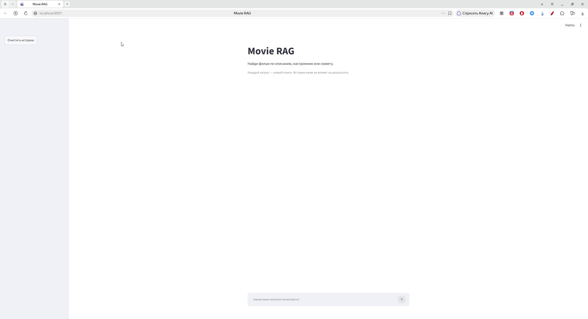

# Movie RAG

Поиск фильмов по описанию, настроению или сюжету. Можно написать «роуд-муви»
или описать историю, которую хочется посмотреть.

В основе — 500 фильмов с авторскими описаниями из
[«Кино от Ивана»](https://vk.ru/cinemafromivan). Приложение показывает выбранные
фильмы, исходное описание, зачем их смотреть и ссылку на источник.



## Пять подходов к поиску

| Подход | Что делает |
| --- | --- |
| **BM25** | Ищет совпадения слов запроса и описания. |
| **Dense · BGE-M3** | Находит близкие по смыслу описания. |
| **Hybrid** | Объединяет результаты BM25 и Dense. |
| **Hybrid + Reranker** | Повторно оценивает 20 кандидатов с помощью BGE reranker. |
| **Hybrid + Reranker + Qwen** | Передаёт лучшие 10 фильмов локальному `qwen3:8b`, который выбирает подходящие запросу. |

Интерфейс использует последний подход. Qwen выбирает фильмы, а весь текст
о них берётся из исходных описаний. Каждый запрос — отдельный поиск;
история чата не влияет на результаты.

## Результаты

Все подходы оценены на одном корпусе и одинаковом наборе из **50 запросов**.
Recall@K — доля размеченных релевантных фильмов, найденных в первых K результатах;
в таблице показано среднее по запросам. Выше — лучше.

| Подход | Recall@1 | Recall@3 | Recall@5 | Recall@10 | Recall@20 |
| --- | ---: | ---: | ---: | ---: | ---: |
| BM25 | 0.352 | 0.432 | 0.516 | 0.590 | 0.620 |
| Dense | 0.581 | 0.733 | 0.800 | 0.865 | **0.932** |
| Hybrid | 0.586 | 0.712 | 0.801 | 0.872 | 0.922 |
| Hybrid + Reranker | 0.841 | 0.890 | 0.890 | **0.917** | 0.922 |
| Hybrid + Reranker + Qwen | **0.852** | **0.893** | **0.897** | 0.897 | — |

Для Qwen в Recall@20 стоит прочерк: модель получает только top-10 после reranker.

Reranker даёт лучшую полноту при Recall@10. Qwen немного улучшает первые
позиции, но отбрасывает и часть релевантных фильмов: Recall@10 снижается
с 0.917 до 0.897. Добавление LLM не улучшает все метрики одновременно.

[Полное сравнение, результаты по типам запросов и примеры ошибок](reports/retrieval-benchmark-comparison.md).

## Как составлялись запросы

Запросы подготовлены по исходным описаниям фильмов, с разной степенью близости
к тексту. Выдача моделей не использовалась для выбора релевантных фильмов.

| Тип | Количество | Формулировка |
| --- | ---: | --- |
| `near_exact` | 10 | Близкая к фактам и словам исходного описания. |
| `paraphrase` | 25 | Тот же сюжет другими словами, без названия фильма. |
| `semantic` | 15 | Тематический или составной запрос, которому могут соответствовать несколько фильмов. |

Например, semantic-запрос: «хочу кино о семьях беженцев, которым непросто
устроиться в Великобритании после бегства из своей страны».

Для каждого запроса заранее записаны релевантные фильмы и основания выбора
по текстам корпуса. У 41 запроса один релевантный фильм; у остальных 9 — от 2 до 5.
Разметка составлена и сверена по корпусу с помощью агента; независимой
человеческой проверки пока не было. Это небольшая авторская выборка,
а не универсальная оценка качества рекомендаций. Recall измеряет полноту
по этой разметке, а не точность каждого выбранного фильма.

[Датасет](data/eval/retrieval_eval.jsonl) · [Методика и ограничения](data/eval/README.md).

## Запуск

Нужны Python 3.12+, uv и Ollama. Если сервер Ollama ещё не запущен,
запустите его в отдельном терминале:

```bash
OLLAMA_NO_CLOUD=1 ollama serve
```

Затем в каталоге проекта:

```bash
ollama pull qwen3:8b
uv sync
uv run streamlit run app.py
```

Приложение откроется по адресу `http://localhost:8501`.
Qwen работает локально, API key не нужен. При первом запуске загружаются
модели поиска. Необязательные настройки Ollama — в [.env.example](.env.example).

Подробности реализации, команды оценки и проверок вынесены в
[технические заметки](docs/technical-notes.md).
